# RabbitMQ_ML
- 크롤링한 데이터를 다양한 방법으로 처리하고 기계학습을 통해 뉴스 키워드를 예측하는 API 서비스 개발  

## 소개
1. 뉴스 내용을 **Node.js**로 **Crawling** 해서 **RabbitMQ**에 집어넣고 Queue의 데이터를 **Spring Boot**로 Consume해서 JPA를 이용하여 **PostgreSQL**에 저장한다.
2. DB에 있는 Data를 csv(tsv) 파일로 export 하고 뽑아낸 파일을 Python으로 **Machine Learning** 진행한다.
3. 학습된 model을 저장하고 **API**로 서비스 후 Postman을 통해 테스트한다.

## Contents
1. [Using](#using)
2. [Project Order](#project-order)
3. [License](#license)

---------------------------------------------

## Using
1. **BackEnd** - Spring Boot (v2.3.9 / Spring Initializer), Node.js(v14.16.0), Python(v3.9.2)
2. **Messege Queue** - RabbitMQ(v3.8.12)
3. **DataBase** - PostgreSQL(v13.2)
4. **Server** - Docker(v20.10.5 / for PostgreSQL, RabbitMQ)
5. **IDE** - IntelliJ(Community / 11.0.9.1 / 2020.3.2), Visual Studio Code(v1.54.3)
6. **Testing** - Postman
7. **Etc** - JSON, JPA, Scikit-learn, pickle, sanic, pandas, lombok, re, ...

----------------------------------------------

## Project Order
<ul>
    <li>Detailed : Can be found in each source code. Comments are written in each source code.</li>
</ul>

1. **Crawling + Producer(MQ)** : 뉴스 페이지를 크롤링하고 데이터를 Message Queue로 전송  
    1. **Node.js** 설치 여부 확인(Command) <sub>[Node.js 설치 페이지](https://nodejs.org/ko/)</sub>  
        ```{.bash}
        > node -V  
        ```
    
    2. **Visual Studio Code**로 프로젝트를 생성하고 **Crawling, Producer** 생성 (VSCode 내 Terminal에서 node.js는 모듈, 패키지 설치를 npm을 이용한다.)  
        ```{.bash}
        > npm init  
        ```  
        package.json 생성하기 위한 command / 프로젝트 이름, 버전, description, **entry point(파일의 시작)**, test command, git repositry 등 작성  
        ```{.bash}
        > npm install request  
        ```
        **request** : http 요청 모듈
        ```{.bash}
        > npm install cheerio
        ```
        **cheerio** : 문자열 파싱 모듈 (body 부분만 읽어오기 위해 사용)  
    
    3. 설치 후에 package-lock.json (내부 의존성에 대한 버전) 파일, node_modules (설치한 모듈의 의존성을 확인하고 필요한 것들 자동으로 설치) 폴더 자동 생성됨.  
    
    4. **app.js** 작성 (app.js로 만든 이우 => package.json 내 "main" 부분 / Entry Point로 지정한 파일)  
    
    5. **Docker** 설치 여부 확인(Command) <sub>[Docker 설치 페이지](https://hub.docker.com/editions/community/docker-ce-desktop-windows/)</sub>  
    Window에서 설치할 시 Enable Hyper-V Windows Features 체크 필요  
        ```{.bash}
        > docker --version
        ```
    
    6. **RabbitMQ** 를 **Docker**로 띄우기(Command) <sub>[참고](https://hub.docker.com/_/rabbitmq)</sub>  
        ```{.bash}
        > docker run -it --rm --name rabbitmq -p 5672:5672 -p 15672:15672 rabbitmq:3-management  
        ```
        
    7. **RabbitMQ 모니터링 페이지**(localhost:15672) 접속, (기본 guest / guest)
        <p align="center">
            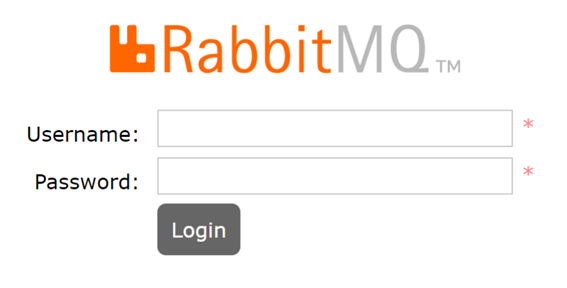
        </p>
        
    8. **Message Queue** 생성  
        <p align="center">
            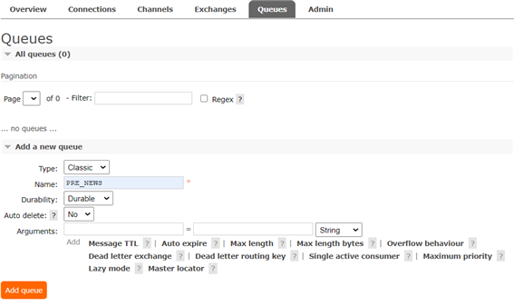
        </p>
        
    9. VSCode Terminal에서 **app.js 실행** (Node.js에서 크롤링 + Rabbit MQ로 메시지 전송)  
        ```{.bash}
        > node app  
        ```
        
        <p align="center">
            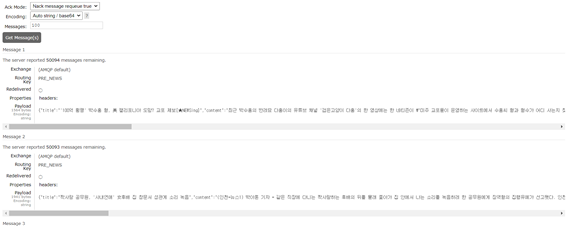
        </p>  
  
2. **Consumer(MQ) + DB Save** : Spring Boot를 이용해서 Queue의 데이터를 읽고, PostgreSQL에 데이터 저장  

    1. [Spring Initializer](https://start.spring.io/)로 **Spring Boot 프로젝트 생성**  
    
        <p align="center">
            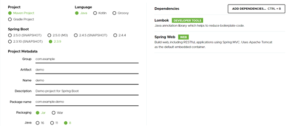
        </p>
        
    2. 프로젝트 내 파일 설명  
        <ul>
            <li>.idea : IntelliJ 설정 파일</li>
            <li>.mvn : 메이븐 관련 파일</li>
            <li>src/main : 실행될 코드</li>
            <li>main/resources : 서버에서 프론트엔드 개발을 한다고 할 때 정적파일 위치 + 그 외에 프로젝트에 대한 설정 파일 위치</li>
            <li>application.properties : 서버 DB 등 설정 파일</li>
            <li>src/test : 실행될 코드를 테스트하는 코드</li>
            <li>.gitignore : 프로젝트를 깃으로 관리할 때 제외할 폴더 및 파일</li>
            <li>pom.xml : Maven을 이용하여 dependency 설정, 관리</li>
            <li>DemoApplication.java : 프로젝트 실행 위치</li>
        </ul>
        
    3. **application.properties** : local에 Oracle port와 겹쳐서 Spring Boot 내장 Tomcat Server port를 8090으로 변경  
    
    4. **application.yaml** 파일 생성 : 서버, DB 등 설정  
        <p align="center">
            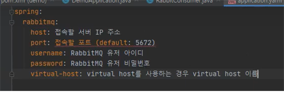
        </p>
        
    5. [RabbitMQ Dependency](https://spring.io/guides/gs/messaging-rabbitmq/) 추가
        <p align="center">
            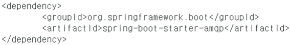
        </p>
    
    6. dependency 추가 후 의존성 적용이 안될 경우(clean -> install)
        <p align="center">
            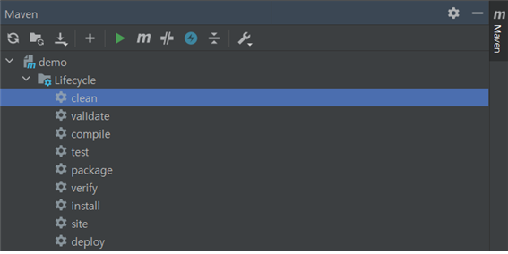
        </p>
    
    7. **RabbitConsumer Class** 생성
        <ul>
            <li>RabbitMQ의 메시지를 읽어오기 위한 RabbitListener 생성, 읽어온 데이터를 자바 객체로 읽어오기 위해</li>
            <li>jackson : JSON to Object / Object to JSON 에 사용</li>
        </ul>
    
    8. **NewsDto Class** 생성
        <ul>
            <li>읽어온 데이터를 저장할 자바 객체 생성</li>
        </ul>
    
    9. **PostgreSQL Docker**로 띄우기 (Command) <sub>[참고](https://hub.docker.com/_/postgres)</sub>  
        ```{.bash}
        > docker run --name pgsql -d -p 5432:5432 POSTGRES_PASSWORD=postgrespassword postgres  
        ```
        
    10. PostgreSQL 모니터링 APP, **pgAdmin** [설치](https://www.pgadmin.org/download/) 및 사용 <sub>(password는 위에서 설정한 password)</sub>  
        <p align="center">
            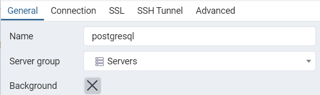
        </p>
        
        <p align="center">
            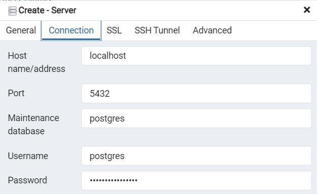
        </p>
        
        <p align="center">
            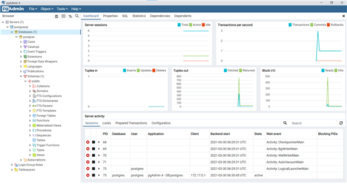
        </p>
    
    11. PostgreSQL, JPA **Dependency 추가**  
        <p align="center">
            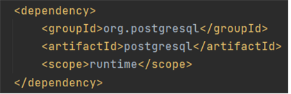
        </p>
        <p align="center">
            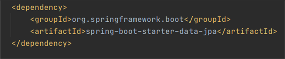
        </p>
    
    12. **application.yaml 파일 설정**
        <p align="center">
            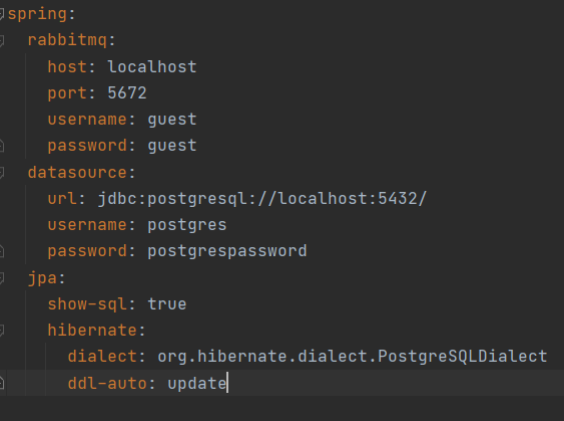
        </p>
        
    13. **JpaRepository Interface** 생성 <sub>[참고](https://jobc.tistory.com/120)</sub>  
    
    14. **Spring Boot 실행**  
        <p align="center">
            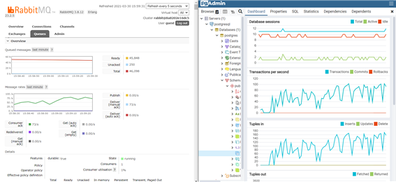
        </p>
        <p align="center">
            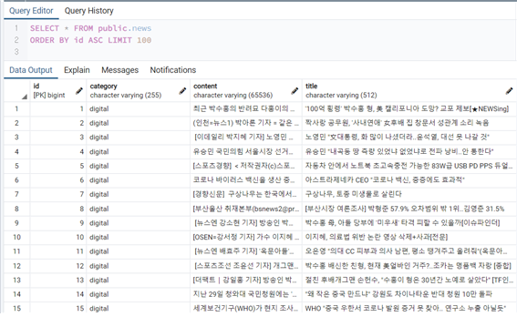
        </p>  
        
3. **ML + API Service** : PostgreSQL의 데이터를 csv 파일로 export하고 해당 데이터로 머신러닝 진행 후 model을 **API로 서비스**한다.
    1. PostgreSQL의 데이터를 **csv(tsv)로 저장** <sub>(pgAdmin에서)</sub>
        <p align="center">
            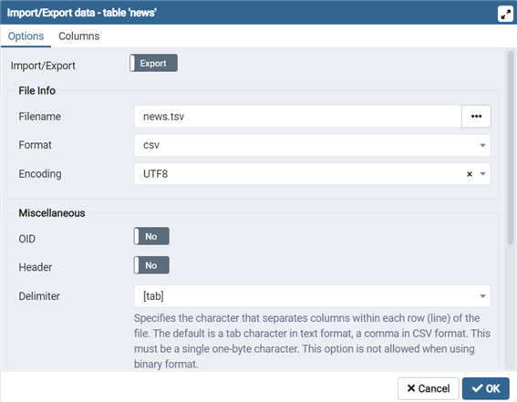
        </p> 
    
    2. 저장된 tsv 파일의 첫 번째 줄에 **column 추가**
        <p align="center">
            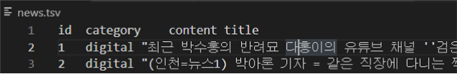
        </p>  
  
    3. **Anaconda** [설치](https://www.anaconda.com/products/individual#Downloads) <sub>(Python 개발 환경 세팅)</sub>
    
    4. **Anaconda Prompt** 실행, 필요한 라이브러리 설치  
        ```{.bash}
        (base)\> conda create -n 프로필명 python=버전  
        ```
        ```{.bash}
        (base)\> conda activate 프로필명  
        ```
        ```{.bash}
        (프로필명)\> pip install -U scikit-learn pandas numpy sanic  
        ```
        <ul>
            <li>scikit-learn : 머신러닝을 하기 위한 라이브러리</li>
            <li>pandas : 데이터 컨트롤 / csv 파일을 연다.</li>
            <li>sanic : API 형태로 제공하기 위해 사용 (API 연결)</li>
        </ul>
    
    5. **ML.py** (Python code) 작성 후 실행
        ```{.bash}
        (프로필명)\> python ML.py  
        ```
        <p align="center">
            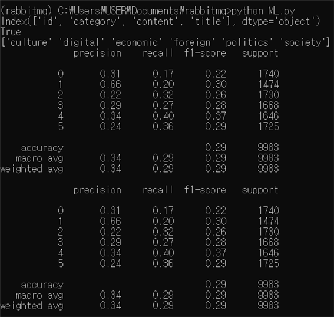
        </p>
    
    6. **api.py** 작성 후 실행  
        ```{.bash}
        (프로필명)\> python api.py  
        ```
    
    7. 기사 Contents 가져오기 <sub>(개발자 모드 / Postman에서 json 형식으로 보내기 위해서 replace 필요)</sub>
        ```{.bash}
        > \`이곳에 기사 복사, 붙여넣기\`.replace(/\“/g,"’").replace(/\n/g,"");
        ```
        <p align="center">
            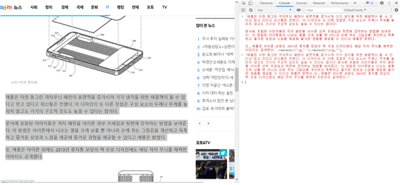
        </p>
    
    8. [Postman](https://www.postman.com/downloads/)을 이용하여 **API 호출 및 테스트** 실행  
        <p align="center">
            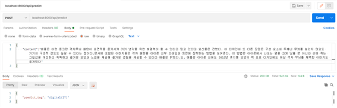
        </p>
        <p align="center">
            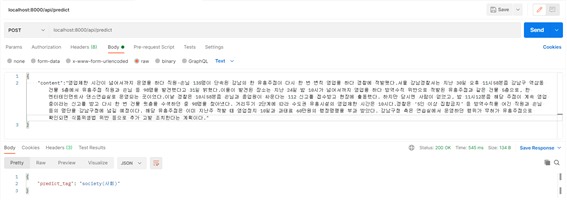
        </p>
--------------------------------------------

## License
- The Project was started by [Foorogrammer](https://github.com/lleellee0).
- I started the project after seeing [Foorogrammer's lecture](https://www.youtube.com/playlist?list=PLqh5vK4CKWeZcFWUN2PufqjUqSeICAHl2).